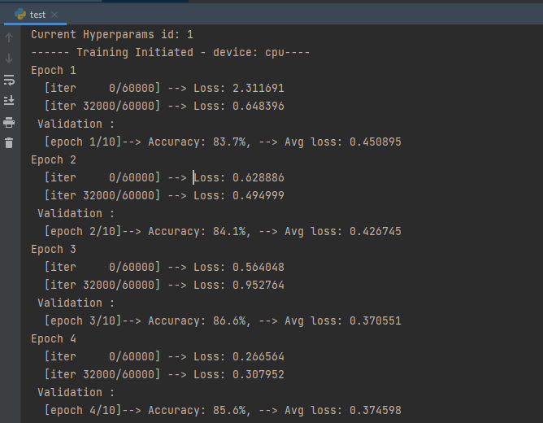
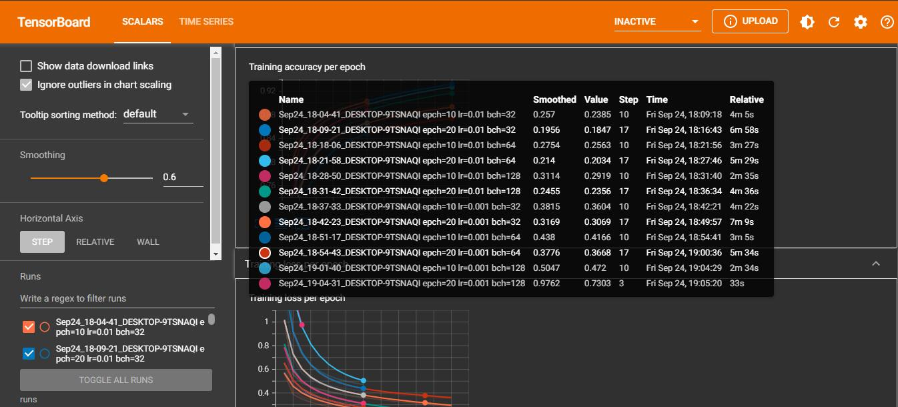

# SamPytorchHelper
A Pytorch package that can be used directly with pytorch and tensorboard to simplify the training process while
improving the code readability. One no longer needs to explicitly write the training loop, saving the model and upload
the training information to tensorboard.

## Installation
Firstly, we need to install all the required libraries within the `requirements.txt` file. One way to do that is by 
pip installing the libraries using this command:  
```commandline
pip install -r ./requirements.txt
```
Secondly, install the `SamPytorchHelper` package from PyPI: 
```commandline
pip install SamPytorchHelper
```
When it is done, we can import the class form the package by:
```python
from SamPytorchHelper.TorchHelper import TorchHelperClass
```
 the `TorchHelper` module contains the `TorchHelperClass` that is used to train the network. 

## TorchHelperClass description 
TorchHelperClass contains mainly 4 attributes and 2 methods. 
1. **Attributes**
    ```python
    class TorchHelperClass:
        def __init__(self, model, loss_function, optimizer, comment='')
    ```
   At initialization, the class should receive 4 arguments: the network, the loss function, the optimizer, and a comment 
string. The `comment` should contain the information needed when the trained model will be saved 
and when it will be displayed in tensorboard. It provides an extra-information to model for better identification. 
the `comment` string may include the hyperparameter values such as epoch, lr, batch, etc. 

2. **Methods** 

     The TorchHelperClass has mainly 2 methods: 
   * *train_model:* 
     ```python
     def train_model(self, train_dataloader, val_dataloader, num_epoch=50, iter_print=100):
        """
        :param train_dataloader: training set
        :param val_dataloader: validation set
        :param num_epoch: the total number of epochs. default = 50
        :param iter_print: indicate when to print the loss after how many iteration. default = 100
        :return: current trained model
        """
     ```
   * *save_model:*:
     ```python
     def save_model(self, path):
        """
        :param path: folder where to save the model
        :return: None
        """
     ````
## Example
A complete example implementation  can be found in `test` folder:
* `data folder`: contains the FashionMNIST dataset downloaded using `torchvision`
* `runs folder`: contains the information used by tensorboard. 
* `trained_models folder`: it has the trained model saved after training using the `save_model` method.
* `test.py`: it used to test the 'TorchHelperClass', most importantly, it shows the steps on how we can use the package 
more efficiently to train our network:
  ```python
    ...
    # hyper-parameters
    parameters = dict(
        lr=[0.01, 0.001],
        batch=[32, 64, 128],
        shuffle=[True],
        epochs=[10, 20],
        momentum=[0.9]
    )
    ...
    param_values = [v for v in parameters.values()]
    for id, (lr, batch, shuffle, epochs, momentum) in enumerate(product(*param_values)):
        print("Current Hyperparams id:", id+1)
        train_dataloader = DataLoader(train_data, batch_size=batch, shuffle=shuffle)
        test_dataloader = DataLoader(test_data, batch_size=batch, shuffle=False)

        net = Network()

        criterion = nn.CrossEntropyLoss()
        optimizer = torch.optim.SGD(net.parameters(), lr=lr, momentum=momentum)

        comment = f' epch={epochs} lr={lr} bch={batch}'
        helper = TorchHelperClass(model=net, loss_function=criterion, optimizer=optimizer, comment=comment)
        helper.train_model(train_dataloader, test_dataloader, epochs, 1000)
        helper.save_model('trained_models')
        print()
    ...
  ```
The `parameters` is dict containing all the different value of each hyper-parameters.
It is used for network hyper-parameters tuning where each parameter can have one or a list of values.  

## Results after running test.py

### From the Terminal


### From Tensorboard 
 

  
 
